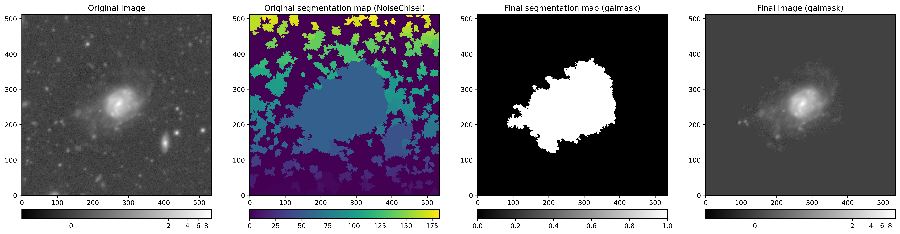

# galmask

[](https://zenodo.org/badge/latestdoi/482832399)

**galmask** is an open-source package written in Python that provides a simple way to remove unwanted background source detections from galaxy images.
It builds on top of `astropy` and `photutils` astronomical Python libraries and the `opencv` and `skimage` image processing libraries.

The main requirements of `galmask` are:
- `astropy` for handling FITS I/O and general-purpose astronomical routines.
- `photutils` for photometry purposes and deblending detected sources.
- `opencv-python` for connected-component analysis.
- `skimage` for general image processing functionalities.

# Installation

## Via `pip`

`galmask` can be installed from PyPI via `pip` by running::

```
pip install galmask
```

## Alternative method

`galmask` can also be installed by cloning the repository and doing a pip install in the project directory::

```
git clone https://github.com/Yash-10/galmask
cd galmask
pip install .
```

It would be beneficial to create a python virtual environment and install the package within it, to prevent
manipulating your global dependency versions.

# Quick example

```python
from astropy.io import fits
from astropy.visualization import AsinhStretch, ImageNormalize, ZScaleInterval, LogStretch

import matplotlib.pyplot as plt
from mpl_toolkits.axes_grid1 import make_axes_locatable

# Import galmask
from galmask.galmask import galmask

def axes_colorbar(ax):
    divider = make_axes_locatable(ax)
    cax = divider.append_axes('bottom', size='5%', pad=0.3)
    return cax

filepath = 'example/gal1_G.fits'
image = fits.getdata(filepath)
npixels, nlevels, nsigma, contrast, min_distance, num_peaks, num_peaks_per_label, connectivity, remove_local_max = 5, 32, 2., 0.15, 1, 10, 3, 4, True  # Parameters for galmask
seg_image = None  # No segmentation map example
orig_segmap = fits.getdata('example/gal_seg1.fits')

galmasked, galsegmap = galmask(
    image, npixels, nlevels, nsigma, contrast, min_distance, num_peaks, num_peaks_per_label,
    connectivity=4, kernel=fits.getdata('kernel.fits'), seg_image=seg_image, mode="1",
    remove_local_max=True, deblend=True
)

# Plotting result.
fig, ax = plt.subplots(1, 4, figsize=(24, 6))

# For keeping original and final images on same scale.
vmin = min(image.min(), galmasked.min())
vmax = max(image.max(), galmasked.max())

# fig.suptitle(filepath)
norm1 = ImageNormalize(image, vmin=vmin, vmax=vmax, interval=ZScaleInterval(), stretch=LogStretch())
im0 = ax[0].imshow(image, norm=norm1, origin='lower', cmap='gray')
ax[0].set_title("Original image")
cax0 = axes_colorbar(ax[0])
fig.colorbar(im0, cax=cax0, orientation='horizontal')

im1 = ax[1].imshow(orig_segmap, origin='lower')
ax[1].set_title("Original segmentation map (photutils)")
cax1 = axes_colorbar(ax[1])
fig.colorbar(im1, cax=cax1, orientation='horizontal')

im2 = ax[2].imshow(galsegmap, origin='lower', cmap='gray')
ax[2].set_title("Final segmentation map (galmask)")
cax2 = axes_colorbar(ax[2])
fig.colorbar(im2, cax=cax2, orientation='horizontal')

norm2 = ImageNormalize(galmasked, vmin=vmin, vmax=vmax, interval=ZScaleInterval(), stretch=LogStretch())
im3 = ax[3].imshow(galmasked, norm=norm2, origin='lower', cmap='gray')
ax[3].set_title("Final image (galmask)")
cax3 = axes_colorbar(ax[3])
fig.colorbar(im3, cax=cax3, orientation='horizontal')

plt.show()
```

Output:



# Documentation

The documentation is generated using the [Sphinx](https://www.sphinx-doc.org/) documentation tool and hosted by [Read the Docs](https://readthedocs.org/).
You can find the API reference and also some empirical tips to use galmask there.

# Tests

For running the tests, you would need to install [pytest](https://docs.pytest.org/). You can navigate to the `tests/` directory and run:

```
pytest <name_of_file>
```

# Contribute

Contributions are welcome! Currently, there seem to be a few inefficient ways of handling things within galmask, and we would like you to contribute and improve the package!

Please let us know of any bugs/issues by opening an issue in the [issue tracker](https://github.com/Yash-10/galmask/issues).

# Citing


# License and copyright

galmask is licensed under the [MIT License](LICENSE).

Copyright (c) 2022 Yash Gondhalekar
